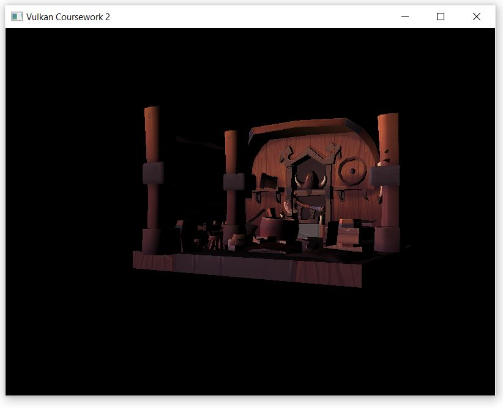

# Vulkan-Renderer
This project was a Master's year coursework in High-Performance Graphics. The goal of this project was to become familiar with using a modern Graphics API and understand the concepts behind using one.
The project contains excessive commmenting as it was part of the marking scheme and all students were required to provide comments for a substantial amount of lines.

## Project

The project is a renderer written entirely in C++. It uses the Vulkan API and GLFW.

## How To Run

It is important to mention that this project was intended for running on the University of Leeds Windows machines in the Master's Student Lab. 
As such, the platform of choice is Windows and the IDE is Visual Studio 2017.

Before running this project, ensure you have Visual Studio installed (Choise of version should not matter) and the latest version of the Vulkan SDK.
The latest version of Visual Studio can be obtained from here:

https://visualstudio.microsoft.com/vs/older-downloads/

The latest versions of the Vulkan SDK can be obtained here:

https://vulkan.lunarg.com/sdk/home

Downlaod the source code from the repository, and simply load the solution file within Visual Studio and run from within the IDE.

## Features

- Custom loader for OBJ files.
- Phong Lighting
- Texturing
- FPS Camera

## Camera Controls

- Use AWSD to move Left, Up, Down and to the Right
- Use the arrow keys to rotate the object in place. 
